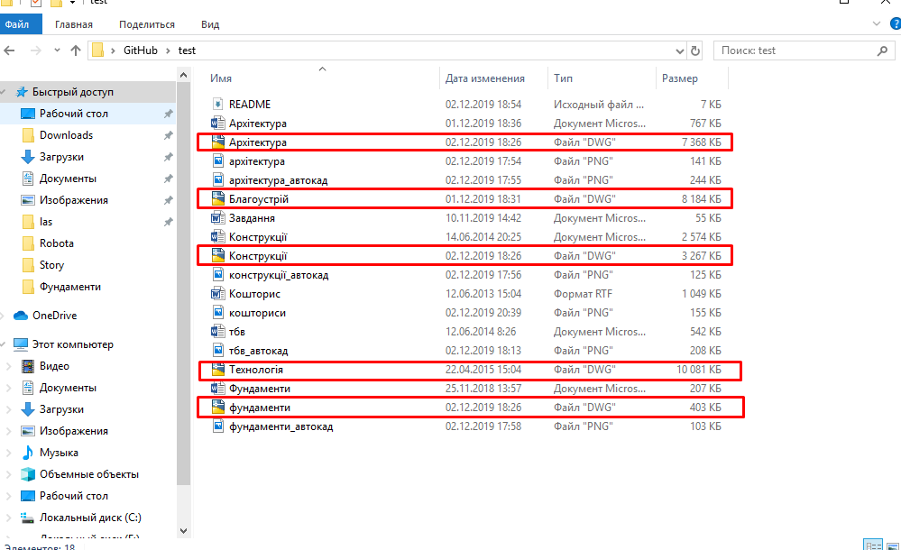
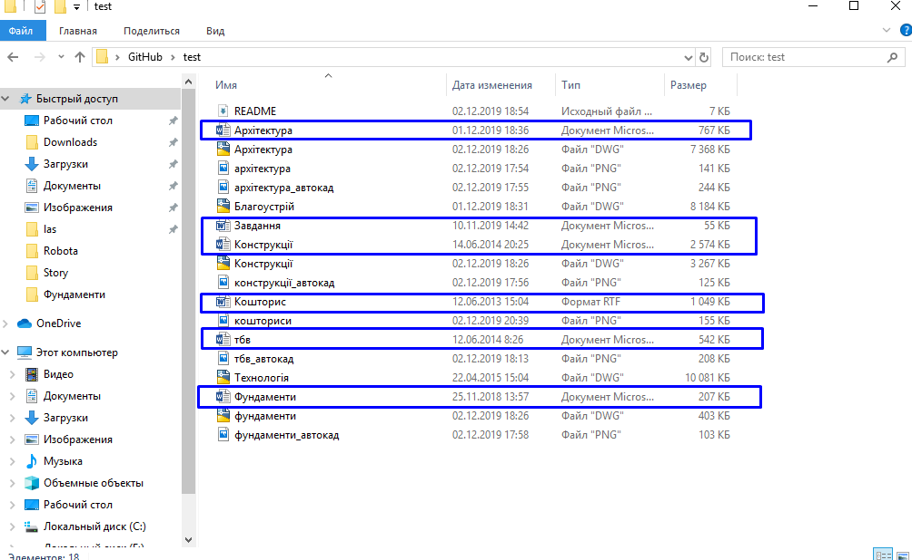
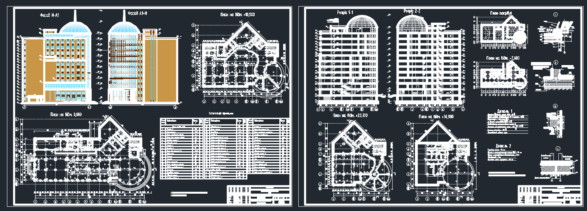
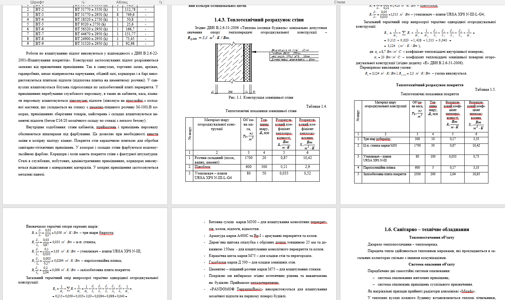
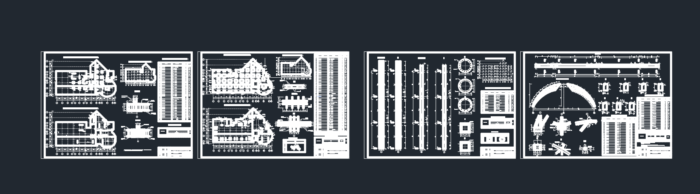
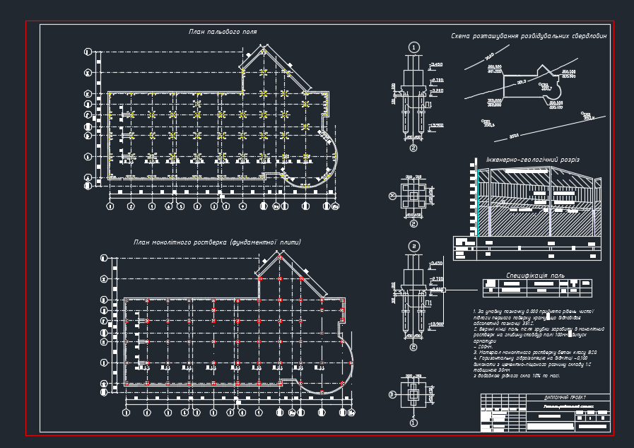
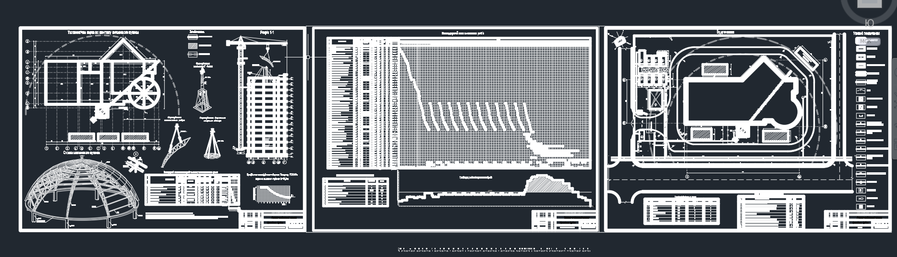
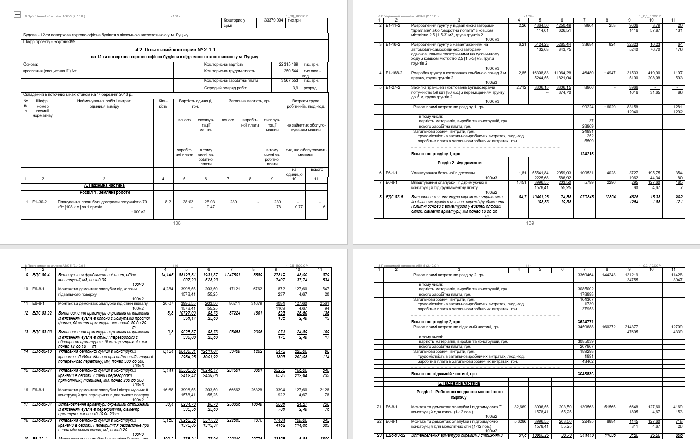

Даний репозиторій містить в собі інженерний проект на тему "Торгово-офісний центр із підземним паркінгом".

Проект містить в собі файли із розширеннями __.dwg__, __.docx__.

*  __.dwg__ - розширення, файли якого відкриваються за допомгою спеціальної програми [AutoCad](<https://www.autodesk.com/products/autocad/overview>), в якій, в свою чергу, інженер-проектант виконує креслення того чи іншого проекту;*

* __.docx.__ - розширення, файли якого відкриваються програмою [Microsoft Office Word](https://office.live.com/start/word.aspx), в якій проектант виконує основні розрахунки для кожного із етапів.*

Файли із розширенням __.dwg__ містять креслення із *архітектурно-планувальної частини*, *конструкцій*, *інженерно-геологічних робіт* та *технології будівельного виробництва.*

Файли із розширенням __.docx__ містять основні розрахунки до файлів із розширенням __.dwg__, а також окремо кошторисну документацію та питання із охорони праці. Зазвичай вони мають назву "Пояснювальна записка".

---
# Аріхтектурно-планувальна частина 
Містить в собі 2-3 листи креслень, де зображені плани типового поверху, перекриття, покрівля, благоустрою та експлікацію приміщень, розрізи по сходовій клітці та по осях.

  

В пояснюючій записці обгрунтовується вибір даної місцевості під забудову, наводиться характеристика технологічного чи функціонального призначення будівлі, показується "роза вітрів" місцевості під забудову та проводиться теплотехнічний розрахунок стіни.

# Розрахунок конструкцій
Містить в собі 3-4 листи креслень, де зображені схеми розміщення арматури у фундаментних плитах, схема купола, специфікації елементів плити перекриття та купола, а також розміщення арматури в колонах та схеми деталей, і їх кріплення.

Пояснююча записка містить в собі розрахунки каркасу будівлі, снігово та вітрового навантаження, які були зроблені в інженерні програмі "ПК ЛИРА".

# Інженерно-геологічні роботи
Даний етап вкличає в себе вивчення та аналіз інженерно-геологічних елементів (ІГЕ), що досягається бурінням 4-6 свердловин в спеціально встановлених точках на будмайданчику. 

На листі відображають плани пальового поля, монолітного ростверка, а також план розташування розвідувальних свердловин.

В пояснюючій записці ведеться основний розрахунок фундаментів, робиться збір навантажень на стіни та колони, і приймається площа поперечного перерізу фундаменту.

# Технологія будівельного виробництва (ТБВ)

Даний етап містить в собі 3 листи креслень, в яких відображаються технологічні карти, будгенплан, календарний план виконання робіт та графік руху робітників при виконані робіт.

Пояснююча записка включає в себе основні розрахунки календарного плану виконання робіт та графіку руху робітників при виконані робіт.

Загалом, даний етап вирішує тривалість будівництва та показує найбільш сприятливу послідовність будівництва від самого початку до здачі об'єкту в експлуатацію.

# Кошторисна документація

Даний етап містить тільки пояснюючу записку, в якій інженер-проектант вирішує питання про вартість будівництва, вартість заробітних плат всіх працівників будівництва, вартість будівельних матеріалів, а також їх доставку до будмайданчика.

В окремих випадках досліджуються питання з використання того чи іншого будівельного обладнання, щоб віришити, яке з них буде найефективніше та найдешевше способом банального порівняння.

# Питання з охорони праці

Даний етап також містить тільки пояснюючу записку, в якій йдеться про охорону праці на будмайданчику. Наприклад, використання касок робітниками, належне використання будівельних приладів, загальні питання при кранових та ліфтових роботах.

                             
                               